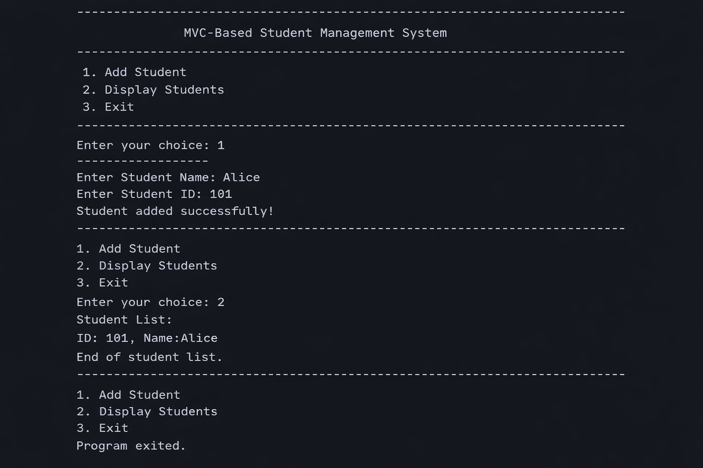

# PCCCS495 - Term II Project

## Project Title
Student Management System using MVC Architecture

---

## Problem Statement (max 150 words)
Managing student information manually can be inefficient and error-prone. This project aims to develop a Student Management System using Object-Oriented Programming (OOP) concepts and MVC (Model-View-Controller) architecture. The system allows storing, updating, and displaying student data in a structured and organized manner. By separating concerns into Model, View, and Controller components, the project ensures modularity, scalability, and maintainability. This approach improves code readability and makes the system easier to extend in future.

---

## Target User
- Teachers  
- Students  
- Educational Institutions  

---

## Core Features
- Add student details  
- Display student information  
- Update student records  
- MVC-based structured design  
- Simple console-based interface  

---

## Technologies Used
- Java  
- Object-Oriented Programming (OOP)  
- MVC Architecture  

---

## OOP Concepts Used
- Encapsulation  
- Abstraction  
- Inheritance  
- Polymorphism  

---

## Project Structure
- Model → `Student.java`  
- View → `Studentview.java`  
- Controller → `Studentcontroller.java`  
- Main → `Main.java`  

---

## How to Run
1. Compile all Java files  
2. Run `Main.java`  
3. Follow the instructions shown on the console  

---

## Output Screenshots

## Advantages
- Modular design using MVC  
- Easy to maintain and extend  
- Clear separation of concerns  
- Reusable code structure  

---

## Limitations
- Console-based interface  
- No database integration  
- Limited scalability  

---

## Future Scope
- Integration with database (MySQL)  
- GUI-based application  
- Web-based system development  
- Advanced features like authentication  

---

## Version
v1.0 Initial Release  

---

## Status
Project completed successfully  

---
## Notes
This project is developed for academic submission and demonstrates basic MVC implementation.

## Author
Sarfaraj Haque  
Roll No: 36  
Institute of Engineering and Management  
